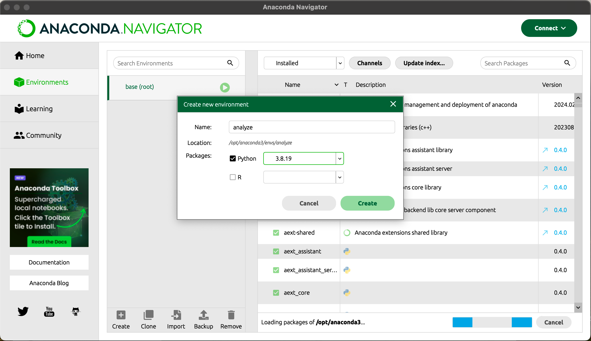

# Алгоритмы компьютерной лингвистики

### Ноутбуки с кодом

- ```text_processing.ipynb```: приёмы обработки текста;
- ```text_tf-idf.ipynb```: вычисление TF-IDF;
- ```models_learning.ipynb```: обучение моделей на основе TF-IDF;
- ```text_analysis.ipynb```: алгоритмы анализа текста;
- ```generate_n-gramm.ipynb```: генерация текста с использованием n-грамм;
- ```generate_word2vec.ipynb```: генерация текста с использованием World2Vec;
- ```text_practice.ipynb```: практические задания по анализу сообщений;

### Запуск среды для ноутбуков в Anaconda:
 
1. Установить Anaconda (https://www.anaconda.com/download, нажать *skip registration*)
2. Создать дополнительную виртуальную среду окружения:
    - Перейти в **Environments** и нажать **Create**
    - В окне выбрать **Python 3.8.xx**, ввести название среды (например, analyze) и нажать **Create**



3. Перейти в **Home** и установить **Jupiter NoteBook**, нажав на **Install** под его значком


4. Перейти в **Environments**, нажать на значок *play* напротив созданной среды и выбрать **Open with Jupiter NoteBook**

